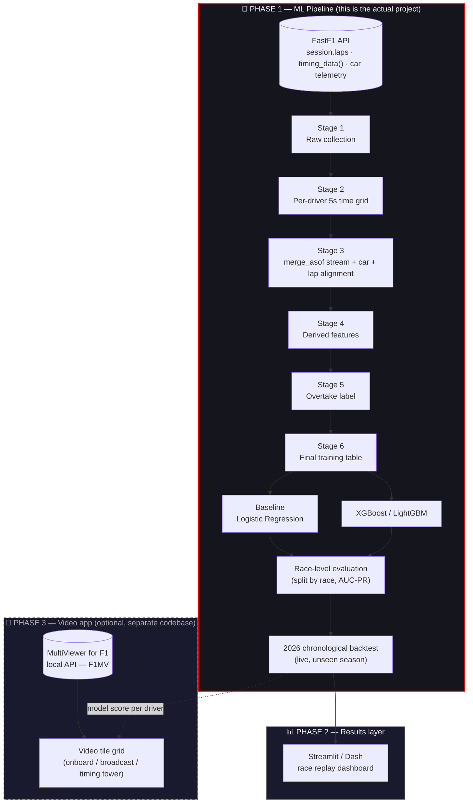
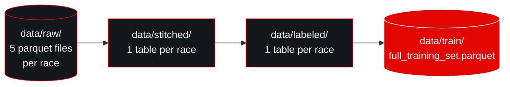
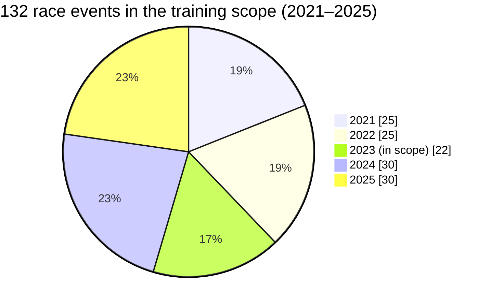
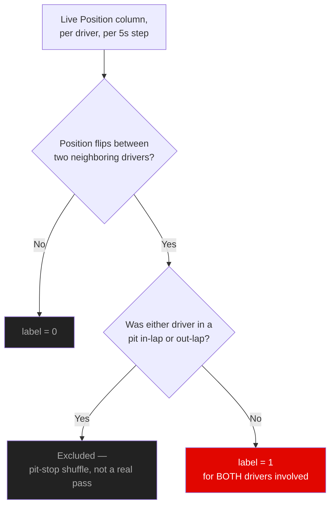
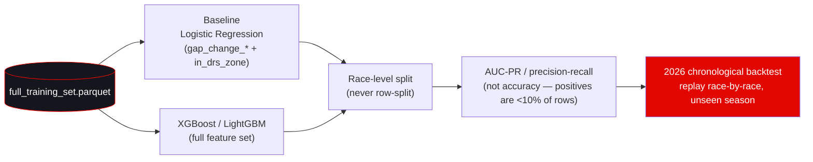

<div align="center">


<br/>

[](https://github.com/codera647/F1_Multiview_ML_Feed_Estimation)
[](https://github.com/users/codera647/projects/4)
[](https://github.com/codera647/F1_Multiview_ML_Feed_Estimation/issues)
[](https://github.com/codera647/F1_Multiview_ML_Feed_Estimation/commits)
[](LICENSE)

[](https://www.python.org/)
[](https://docs.fastf1.dev/)
[](https://pandas.pydata.org/)
[](https://xgboost.readthedocs.io/)
[](https://github.com/users/codera647/projects/4)

</div>

<br/>

> **The twist:** most F1 multiview tools decide what to show you *after* the pass has already happened. This project trains a model on historical FastF1 timing data — gaps, DRS zones, tyre age, pit windows — to spotlight the feed worth watching a few seconds **before** the overtake happens, not after.

<br/>

## Table of Contents

- [Why this exists](#why-this-exists)
- [System architecture](#system-architecture)
- [The data pipeline, stage by stage](#the-data-pipeline-stage-by-stage)
- [The bug that made this project real](#the-bug-that-made-this-project-real)
- [Data scope](#data-scope)
- [Feature reference](#feature-reference)
- [The overtake label](#the-overtake-label)
- [Modeling & evaluation](#modeling--evaluation)
- [Data quality: what got flagged and why](#data-quality-what-got-flagged-and-why)
- [Repository structure](#repository-structure)
- [Roadmap](#roadmap)
- [Getting started](#getting-started)
- [Open research questions](#open-research-questions)
- [License](#license)

<br/>

## Why this exists

Watching a Formula 1 broadcast (or a multiview app like [MultiViewer for F1](https://multiviewer.app/)) means constantly guessing which of 20 onboard/broadcast feeds is about to matter. By the time a director cuts to an overtake, it's already visible on the timing tower — the *interesting* part, the closing gap and the DRS-assisted run-up, already happened off-screen.

This project reframes that as a supervised learning problem: given a driver's live gap-to-car-ahead, DRS zone status, tyre age, and recent pit history at any 5-second timestamp, **predict whether an on-track pass involving that driver completes in the next 10 seconds.** A model that gets this right can drive a "recommended feed" spotlight seconds ahead of the moment, instead of reacting to it.

The project is deliberately split into two independent systems, built in this order:

| Phase | What | Priority |
|---|---|---|
| **Phase 1** | The ML pipeline — data collection, feature engineering, labeling, training, evaluation | Highest — this is the actual ML engineering work |
| **Phase 2** | A lightweight Streamlit/Dash dashboard that replays a real race and shows the model's live per-driver score | Proves the model works before any video plumbing gets built |
| **Phase 3** *(optional)* | A companion video-tile app built on [MultiViewer for F1's local API (F1MV)](https://github.com/f1mv/f1mv-api-documentation), highlighting the recommended feed | Systems engineering, not ML — kept as a separate codebase, revisited only once Phases 1–2 are solid |

<br/>

## System architecture

<details open>
<summary><strong>High-level view — two systems, on purpose</strong></summary>



</details>

The two systems never share code. The ML pipeline outputs a per-driver, per-timestamp score; the video app (if it gets built) is just a consumer of that score over a local API. This keeps the actual ML work — the part that matters for a motorsport ML engineering portfolio — decoupled from video streaming, DRM, and UI concerns.

<br/>

## The data pipeline, stage by stage



<table>
<tr><th>Stage</th><th>What it does</th><th>Status</th></tr>

<tr><td><strong>1 · Raw collection</strong></td>
<td>Pulls <code>session.laps</code>, <code>api.timing_data()</code> (split into <code>laps_raw</code> + <code>stream</code>), car telemetry, and position data per race. Saves 5 parquet files per race/session to <code>data/raw/</code>.</td>
<td>✅ Done — 132/132 races</td></tr>

<tr><td><strong>2 · Per-driver time grid</strong></td>
<td>Builds one row per driver per <strong>5-second step</strong>, using <em>each driver's own</em> <code>LapStartTime.min()</code> → <code>Time.max()</code> — not a session-wide shared range. This is what makes a retired/DNF/DNS driver's grid stop at their real last timestamp instead of forward-filling stale data to the end of the session.</td>
<td>✅ Done — validated on real retirement cases</td></tr>

<tr><td><strong>3 · Stream alignment</strong></td>
<td><code>pandas.merge_asof(direction='backward', by='Driver')</code> joins gap/interval/position data, car telemetry (Speed/DRS), and lap context (tyre/pit/flag, keyed on <code>LapStartTime</code>) onto the grid. See <a href="#the-bug-that-made-this-project-real">the bug below</a> — this stage is where a real production-grade data bug was found and fixed.</td>
<td>✅ Done — 132/132 races stitched</td></tr>

<tr><td><strong>4 · Derived features</strong></td>
<td>Computes <code>gap_change_3s/5s/10s</code> (differencing the gap over each window — likely the strongest signal alongside DRS zone), <code>in_drs_zone</code> (simplifying FastF1's DRS codes: 8 = eligible, ≥10 = active), and <code>recent_pit_stop_nearby</code> (the undercut signal). Also where the lap-1-retirement-during-red-flag edge case gets resolved (see below).</td>
<td>🟡 Ready — next up</td></tr>

<tr><td><strong>5 · Overtake label</strong></td>
<td><code>label = 1</code> if a driver completes an on-track pass within the next 10 seconds, else <code>0</code> — both drivers involved get <code>label = 1</code>. Detected automatically by watching the live <code>Position</code> column flip between two neighboring drivers, excluding any swap where either driver was in their pit in/out-lap (so pit-stop shuffles never get mislabeled as a real pass). Fully scripted weak supervision — no manual annotation.</td>
<td>⬜ Backlog</td></tr>

<tr><td><strong>6 · Final training table</strong></td>
<td>Persists each race's labeled table to <code>data/labeled/</code>, then concatenates all of them into <code>data/train/full_training_set.parquet</code> — the single file the model actually trains on.</td>
<td>⬜ Backlog</td></tr>

</table>

<br/>

## The bug that made this project real

The single most important engineering finding in this project so far, because it's the difference between a pipeline that *looks* like it works and one that actually does.

```mermaid
sequenceDiagram
    participant Stream as stream_data (FastF1)
    participant Laps as laps_data / car_data (FastF1)
    participant Merge as pandas.merge_asof(by="Driver")

    Note over Stream,Laps: stream_data's Driver column holds<br/>raw car-number strings: "10", "44", "16" ...
    Note over Laps: laps_data / car_data use<br/>3-letter abbreviations: "GAS", "HAM", "LEC" ...

    Stream->>Merge: Driver = "10"
    Laps->>Merge: Driver = "GAS"
    Merge--xMerge: no match — every row NaN
    Note over Merge: gap_ahead, gap_leader, Position<br/>came back 100% NaN, silently

    rect rgb(20,60,20)
    Note over Stream,Laps: FIX — remap stream_data's Driver through<br/>that race's own DriverNumber → Driver map<br/>BEFORE anything else touches it
    end
```



`stream_data`'s `Driver` column is raw car-number strings while `laps_data`/`car_data` use 3-letter driver abbreviations. `merge_asof(by="Driver")` silently matched nothing — no error, just every row of `gap_ahead`/`gap_leader`/`Position` coming back `NaN`. The fix: build a per-race `DriverNumber → Driver` map from `laps_data` and remap `stream_data`'s `Driver` column immediately after loading, before the grid, before the gap-parsing, before anything.

Validated on 5 deliberately targeted races (including the exact lap FastF1's own loader flagged as a possible internal bug) before trusting it at scale. Full write-up lives in `Debugging Log.md` in the project vault.

Also fixed in the same pass — a **four-shape parsing rule** for `GapToLeader` / `IntervalToPositionAhead`, which FastF1 returns as a mix of real numeric gaps (`"+1.234"`), lap-crossing markers (`"LAP 1"`), genuine lapped-status strings (`"1 L"`), and malformed session-end artifacts (`"1L"`) — each handled differently, and all cleaned **before** the `merge_asof`, at the stream's own native timestamps, never after.

<br/>

## Data scope

<div align="center">



</div>

| Season | GP | Sprint | In scope | Notes |
|---|---|---|---|---|
| 2021 | 22 | 3 | 25 / 25 | Sprints brand new that year — British, Italian, São Paulo |
| 2022 | 22 | 3 | 25 / 25 | Emilia Romagna, Austrian, São Paulo |
| 2023 | 17 | 5 | 22 / 28 | 6 sessions excluded (see below) |
| 2024 | 24 | 6 | 30 / 30 | — |
| 2025 | 24 | 6 | 30 / 30 | — |
| **2026** | — | — | **held out entirely** | Used as a live chronological backtest, not for training |

Six 2023 sessions are deliberately excluded rather than backfilled: Round 2 (Saudi Arabian GP) failed upstream at collection time and was diagnosed as not worth chasing further; Rounds 3, 4 (R+S), 5, and 6 loaded cleanly in diagnostics but were never actually saved — rather than backfill them later, the decision was to scale on exactly what's already collected and validated.

<br/>

## Feature reference

<details>
<summary><strong>Expand: the training table's column reference</strong></summary>

| Column | Source | Notes |
|---|---|---|
| `gap_ahead`, `gap_leader` | `IntervalToPositionAhead` / `GapToLeader`, cleaned | Four-shape parsing rule applied before alignment |
| `gap_ahead_is_lapped`, `gap_leader_is_lapped` | Derived from the parsing rule | Flags the genuine lapped-status shape |
| `gap_change_3s` / `_5s` / `_10s` | Derived, Stage 4 | Differencing `gap_ahead` over each window — likely the strongest signal alongside DRS |
| `in_drs_zone` | Derived from `DRS` | FastF1 codes simplified: 8 = eligible, ≥10 = active |
| `recent_pit_stop_nearby` | Derived from `PitInTime` / `PitOutTime` | The undercut signal |
| `Position`, `Speed` | Live stream / car telemetry | — |
| `Compound`, `TyreLife`, `Stint` | `session.laps` | Tyre context |
| `TrackStatus` | `session.laps` | 1 = green; anything else = flag/SC/VSC/red |
| `sector_time_vs_best` | *not finalized* | Candidate: current sector pace vs. personal/session best |
| `laps_behind` | *candidate, unconfirmed* | From the `GapToLeader` `"N L"` shape |
| `pos_data` X/Y/Z | Pulled, currently unused | Free byproduct of `session.load()` — undecided if it ever feeds a proximity feature |

</details>

<br/>

## The overtake label



`label = 1` if a driver completes an on-track pass (overtaking or being overtaken) within the next 10 seconds. Fully automatic, weak/heuristic supervision on already-finished races — no manual annotation involved.

<br/>

## Modeling & evaluation



Two rules that matter more than the choice of model:

1. **Split by race, never by row.** Rows from the same race in both train and test leaks information — laps 40 and 41 of the same overtake are not independent samples.
2. **Evaluate on AUC-PR / precision-recall, not accuracy.** Imminent overtakes are a small minority of rows — a model that always predicts "nothing happening" scores high accuracy while being useless.

The 2026 season is held out of training entirely and used as a **live chronological holdout** — replayed race-by-race as the season actually happens, checking the model's top pick at each moment against real known overtakes. This doubles as the project's strongest demo artifact.

<br/>

## Data quality: what got flagged and why

Full-scale run across all 132 races: **127 succeeded, 0 failed, 3 flagged** for `gap_ahead` null% above the 5% threshold. Each was individually investigated — none turned out to be a pipeline bug:

| Race | Null % | Real cause |
|---|---|---|
| 2021 Belgian GP (R) | 8.4% | Genuine 3-lap red flag — one of the shortest, strangest races in F1 history |
| 2024 Monaco GP (R) | 6.8% | Real 4-car lap-1 pileup (HUL, PER, MAG, OCO) during an extended red flag |
| 2025 Belgian GP (S) | 5.6% | Genuinely disrupted Gasly session |

The 2024 Monaco case surfaced a real edge case worth a design decision: a driver eliminated on lap 1 during a long red flag gets a grid that's **long but entirely empty** (zero raw stream rows for the full stoppage duration) — a different shape than the existing retirement-cutoff check, which assumes a grid that ends *early*, not one that's empty throughout. Tracked as a Stage 4 design question.

<br/>

## Repository structure

```
F1_Multiview_ML_Feed_Estimation/
├── data/
│   ├── raw/           # Stage 1 — 5 parquet files per race (laps, laps_raw, stream, car, pos)
│   ├── stitched/      # Stage 2+3 — one aligned table per race
│   ├── labeled/        # Stage 6 — one labeled table per race
│   └── train/          # Stage 6 — full_training_set.parquet
├── src/
│   ├── stage1_collect.py
│   ├── stage2_3_stitch.py     # grid + merge_asof + the driver-remap fix
│   ├── stage4_features.py
│   ├── stage5_label.py
│   └── stage6_build_training_set.py
├── notebooks/          # exploration, validation, and debugging notebooks
├── models/              # baseline + XGBoost training scripts and saved artifacts
├── dashboard/           # Phase 2 — Streamlit/Dash race replay
└── README.md
```

*(Adjust paths above to match what's actually committed — this mirrors the pipeline's real data flow, not necessarily today's exact file layout.)*

<br/>

## Roadmap

Tracked live on the [**F1 Multiview Feed** project board](https://github.com/users/codera647/projects/4) — 19 issues across 3 milestones:

| Milestone | Scope |
|---|---|
| [Phase 1: ML Pipeline & Model](https://github.com/codera647/F1_Multiview_ML_Feed_Estimation/milestone/1) | Data pipeline (Stages 1–6), baseline + XGBoost models, race-level evaluation, 2026 chronological backtest |
| [Phase 2: Results Dashboard](https://github.com/codera647/F1_Multiview_ML_Feed_Estimation/milestone/2) | Streamlit/Dash race replay |
| [Phase 3: Video Multiview App](https://github.com/codera647/F1_Multiview_ML_Feed_Estimation/milestone/3) | F1MV local API evaluation + companion video-tile app *(optional)* |

```mermaid
gantt
    title Current progress snapshot
    dateFormat  X
    axisFormat %s
    section Phase 1
    Stage 1 — Raw collection            :done, s1, 0, 1
    Stage 2 — Time grid                 :done, s2, 1, 2
    Stage 3 — merge_asof alignment      :done, s3, 2, 3
    Stage 4 — Derived features          :active, s4, 3, 4
    Stage 5 — Overtake label            :s5, 4, 5
    Stage 6 — Final training set        :s6, 5, 6
    Baseline + XGBoost                  :model, 6, 8
    Chronological backtest              :backtest, 8, 9
    section Phase 2
    Dashboard                           :p2, 9, 10
    section Phase 3 (optional)
    F1MV API evaluation                 :p3a, 10, 11
    Video tile app                      :p3b, 11, 12
```



<br/>

## Getting started

```bash
git clone https://github.com/codera647/F1_Multiview_ML_Feed_Estimation.git
cd F1_Multiview_ML_Feed_Estimation

python -m venv .venv && source .venv/bin/activate   # Windows: .venv\Scripts\activate
pip install fastf1 pandas numpy xgboost scikit-learn streamlit

# Stage 1 — pull raw data for a race (adjust to your actual script name/args)
python src/stage1_collect.py --year 2024 --round 8 --session R

# Stage 2+3 — build the grid and stitch everything onto it
python src/stage2_3_stitch.py
```

FastF1 caches aggressively — set `fastf1.Cache.enable_cache('cache/')` once at the top of any collection script to avoid re-downloading sessions you already have.

<br/>

## Open research questions

- **Label-window sensitivity study** *(active, locked in)* — the 5-second snapshot interval and 10-second overtake-look-ahead window were both reasoned starting points, never tested against real data. Plan: pull the real DRS-detection-to-pass-completion timing distribution from telemetry, build labeled datasets at several window widths (3s/5s/10s/15s/20s/30s) and snapshot intervals (2s/5s/10s), train the same model on each, and check whether the empirically best window matches the real physical timescale of a DRS-assisted pass.
- **A second label for undercut alerts?** — expand beyond the single overtake label into a separate task predicting a strategic pit-stop-driven position swing, distinct from an on-track pass.
- **Is Phase 3 worth building at all?** — the video app is the highest-effort, lowest-ML-value part of the project by design. Revisit once Phase 2 is solid, not before.

Full detail on every open item is tracked as an issue on the [project board](https://github.com/users/codera647/projects/4).

<br/>

## License

Licensed under the [MIT License](LICENSE) — free to use, modify, and distribute, including commercially, with attribution and no warranty.

<br/>

<div align="center">

Built by [**codera647**](https://github.com/codera647) as a hands-on portfolio project for a career pivot into F1 / motorsport ML engineering.


</div>
